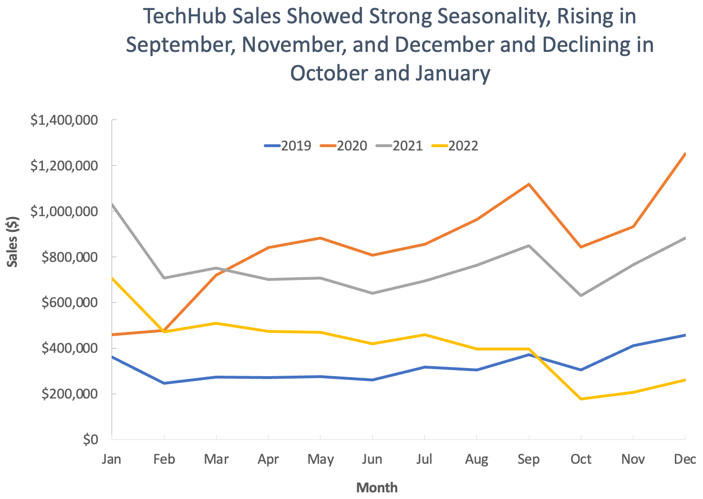

  

 

# TechHub Post-Pandemic Analysis

TechHub is a global e-commerce company founded in 2018 that specializes in selling popular electronics through its website and mobile app. It carries in-demand tech products from brands like Apple, Samsung, and ThinkPad and uses a mix of digital marketing channels, including email campaigns, SEO, and affiliate links, to reach a broad international customer base. As TechHub’s customer base and product offerings have expanded, so has its internal data -  spanning orders, customers, product details, <!-- order refunds, --> and geographic regions. 

This report synthesizes and analyzes data accrued between 2019 - 2022, highlighting data trends, providing insight into how company performance changed during this critical period, and offering recommendations to help guide finance, sales, marketing, product, and operations teams going forward.

Insights and recommendations are focused on the following key areas:

- **Sales Trends Analysis** - Evaluation of historical sales patterns from 2019 - 2022, both by annual sales performance and seasonality, focusing on Revenue, Order Volume, and Average Order Value (AOV).

- **Product Level Performance** - An analysis of TechHub's various product lines, understanding their impact on sales.

- **Regional Comparisons** - An evaluation of sales and orders by region, with emphasis on top-performing countries.

- **Loyalty Program Success** - An assessment of the loyalty program on customer retention and sales.

<!--- **Refunds by Apple Product:** Comparing and analyzing returns by Apple product, focusing on Refund rate, Number of refunds, and AOV. -->  

## Table of Contents
Jump to sections of interest quickly using the following links.

- [TechHub Post-Pandemic Analysis](#techhub-post-pandemic-analysis)
  - [Table of Contents](#table-of-contents)
  - [Executive Summary](#executive-summary)
  - [Deep Dive Insights](#deep-dive-insights)
    - [Annual Sales Trends](#annual-sales-trends)
    - [Seasonality](#seasonality)
    - [Product Performance](#product-performance)
    - [Regional Comparisons](#regional-comparisons)
    - [Loyalty Program Success](#loyalty-program-success)
  - [Final Recommendations](#final-recommendations)
    - [Finance Team](#finance-team)
    - [Sales Team](#sales-team)
    - [Marketing Team](#marketing-team)
    - [Product Team](#product-team)
    - [Operations Team](#operations-team)
  - [Stakeholder presentation (link)](#final-presentation)
  - [Appendix](#appendix)
    - [Assumptions \& Caveats](#assumptions--caveats)
    - [Database Structure \& Cleaning](#database-structure--cleaning)

## Executive Summary
Between 2019 and 2022, TechHub generated $28.1M in revenue, averaging about $7M annually, with nearly 70% concentrated in 2020–2021 as order volume and AOV spiked during peak-pandemic demand. By 2022, AOV returned to 2019 levels, but elevated order volume kept revenue 28% above pre-pandemic ($5M vs. $3.6M). Seasonal sales patterns were consistently observable, especially during the holiday season. North America and EMEA led sales, while APAC delivered the fastest growth and highest AOV, highlighting an expansion opportunity. Four products drove 96% of revenue, and Loyalty Program customers began outperforming non-loyalty customers in 2021, suggesting loyalty could be a key growth lever, though further analysis is needed to confirm performance trends.

<!--  MacBook Air Laptops had the highest refund rates among Apple products, warranting further review given their premium price point and sizable contribution to total revenue.
-->

 **A deep dive into all trends and insights** can be found below, organized into sections.

## Deep Dive Insights

### Annual Sales Trends

Between 2019 and 2022, annual sales performance reflected the volatility of a rapidly shifting market. Across the four years, TechHub brought in $28.1M in revenue from 108K total orders, averaging about $7M and 27K orders per year. However, this average masks an important insight: a majority of total revenue - nearly 70% - was generated in 2020 and 2021, when both order volume and average order value (AOV) surged during the pandemic.

- **2019: Pre-Pandemic Baseline** - TechHub recorded its lowest revenue and order volume across the time period in 2019, generating $3.8M in total sales from 16.8K orders. The average order value (AOV) was $230, a figure later that was later returned to in 2022 during the post-pandemic market correction.

- **2020: Pandemic Surge Begins** - Revenue and AOV peaked at $10.1M and $300, respectively — the highest levels in the 4-year period. This surge also reflected TechHub’s strongest annual growth across all metrics, with +163% growth in total revenue, +101% growth in total orders, and +31% growth in annual AOV.

- **2021: Customer Adjustment** - In 2021, AOV fell -15% to $255 as consumers became more budget-conscious. Despite this, annual sales still remained strong at $9.1M. Annual revenue this year was driven by a record-high in order volume, which climbed another 6% in YoY growth, reaching an all time high of 35.8K orders - highlighting sustained demand for online tech products during the pandemic despite decreases in AOV.

- **2022: Market Normalization** - Revenue dropped significantly in 2022 as the market began to normalize upon the return of in-store spending options. AOV continued to drop, returning back to it's pre-pandemic level of $230. While order volume also declined significantly (-40%), it remained 28% above pre-pandemic levels, contributing directly to almost all post-pandemic annual revenue retention and signaling a potentially lasting shift in consumer behavior moving forward. 

### Seasonality

TechHub sales followed a predictable annual cycle, with sharp holiday peaks in September, November, and December and steep pre- and post-holiday troughs in October, January, and February. Recognizing these patterns is key for optimizing promotions and inventory. Outliers —such as the September 2022 AOV spike or early 2020’s pandemic-driven lift— highlight the importance of monitoring anomalies, as they may reveal promotional or product strategies worth repeating.

- **Holiday-Driven Highs** - The strongest months were November and December, fueled by holiday demand. November delivered the largest average order volume growth (+23%), while December drove the highest average sales growth (+22%). December 2020 set a record high with $1.3M in sales and 4K orders, combining seasonal shopping with pandemic-driven demand.

- **Back-to-School Momentum** - September was another critical growth point, averaging +12% sales growth and +9% order growth. However, September 2022 broke the pattern: order volume plunged -15%, flattening sales growth to 0%. However, a sharp +18% AOV spike —the highest AOV across all years— kept sales from turning negative. This anomaly may signal a successful back-to-school promotion on high-value products such as laptops, worth analyzing further, especially since most other metrics declined during the post-pandemic downturn of 2022. 

- **Seasonal Pullbacks** - The cycle’s weakest points were October, January, and February, when order volumes fell sharply, dragging sales down. October showed the steepest declines (avg -31%), with October 2022 hitting a record -47% order drop and a sales low of $178K, combining seasonal troughs with the broader market downturn. January and February typically showed similar slowdowns (avg -13% and -23% sales growth, respectively), though 2020 was an exception. Back-to-back +13% AOV gains allowed January sales to break even and February to grow +4%, even as orders fell. This unusual lift in AOV in early months of 2020 likely marked the beginning of early pandemic spending increases.

- **Gradual Recovery Periods** - Sales typically stabilized in March, then climbed steadily until September’s spike. The outlier was March 2020, when sales surged +50%—the strongest month across all four years—as pandemic demand accelerated. Outside of 2020, March growth averaged a more modest +4% in sales and +6% in orders. Mid-year also showed smaller dips, with June consistently declining (-9% sales, -11% orders), reliably offset by July’s rebound (+11% sales, +12% orders), keeping momentum intact into fall.

### Product Performance

Between 2019 and 2022, four products generated the vast majority — 96% — of total revenue, highlighting a highly concentrated revenue stream. In contrast, the remaining products contributed only 4% of revenue combined— though they revealed interesting dynamics worth further consideration.

**Top Products | 96% Revenue**

1. **27in 4K Gaming Monitor | Bestseller + High AOV Combo**  
Leading the pack was the 27” 4K Gaming Monitor, which stood out as both a bestseller and a high-value item. With an average order value (AOV) of $421 and 23K units sold, it brought in roughly $9.85M, accounting for 35% of total revenue. This product’s balance of volume and price made it the company’s most valuable contributor over the four-year period.

2. **Apple AirPods Headphones | Most Popular Product**  
Closely behind, Apple AirPods emerged as the most popular product by volume. With nearly 48K units sold — almost half of all orders — it earned $7.73M or 28% of revenue. Despite its lower price point compared to laptops, its widespread popularity positioned it as a reliable driver of sales.

3. **MacBook Air Laptop | Highest AOV**  
Though the MacBook Air Laptop represented only 4% of total orders, its premium price tag ($1,588 AOV) made it significant in terms of revenue, generating $6.29M, or 22% of total revenue. Its performance peaked in 2020, with a staggering 384% increase in annual sales, possibly fueled by the sudden shift to remote work and learning. March 2020 saw the highest month-over-month (MoM) growth for MacBook Airs at 66%, coinciding with widespread school closures and the temporary shutdown of in-store purchasing options.

4. **ThinkPad Laptop | Second Highest AOV + Seasonal Demand**  
Similarly, the ThinkPad Laptop, with an AOV of $1,100, contributed $3.2M (11% of total revenue) from a small base of just under 3K orders. Like Macbook Airs, its sales trajectory also experienced a sharp spike in 2020, as well as standout 92% growth in December 2020. ThinkPad sales showed a clear pattern of year-end peaks, suggesting strong seasonal appeal — potentially linked to holiday gift-giving or end-of-year corporate purchases. 

**Less Impactful Products | 4% Revenue**

5. **Samsung Charging Cable Pack | Low AOV but Popular**  
The Samsung Charging Cable Pack proved surprisingly popular, making up 20% of all orders - although with a low price tag ($20 AOV). While it generated just 2% of total revenue at $442K, its high volume suggests it might have some strategic potential. For example, bundling it with other items could be an effective strategy to increase cart size and elevate overall revenue contribution in key regions.

6. **Samsung Webcam | Latecomer with Promise**  
The Samsung Webcam, launched in 2020, gained traction quickly, accounting for 7% of all orders — a strong showing for a latecomer to the product line. Its growth also aligned with the rise of virtual learning and remote work, again highlighting how external events may have helped shape consumer behavior. It contributed a total of $361K in revenue.

7. **Apple iPhone | High AOV but Disappointing Sales**   
Surprisingly, the flagship item Apple iPhone saw weak sales at just $213K in total revenue. With just 288 total units sold across four years and average monthly sales hovering around six units, the iPhone failed to gain traction with the customer base. Given the low demand, it may be worth either surveying customers for feedback or reallocating resources toward better-performing premium products.

8. **Bose Soundsport Headphones | Low AOV and Disappointing Sales**  
Lastly, the Bose Soundsport Headphones underperformed significantly, generating just $3.3K in total revenue—a mere 0.01% of the four-year total. Order activity was sporadic and absent in many months, making it difficult to distinguish between genuinely low demand and possible data issues. While further investigation into the data pipeline is warranted, current trends suggest the product failed to resonate with TechHub’s customer base and may no longer justify continued support or inventory space.

### Regional Comparisons
 

 
 

Global revenue was highly concentrated in NA and EMEA regions, which together drove 81% of total revenue  at $22.8M and 88K orders. The APAC region showed high earning potential despite smaller volume, while LATAM underperformed across most metrics. 

**North America (NA) — 52% of Global Sales | High Dependence on U.S. Market**   
- Generated $14.6M from 55.8K orders with a slightly above average AOV of $261 (compared to global of $260).
- **U.S.** dominated the region, contributing 91% of NA revenue ($13.2M) and 47% of global sales, underscoring reliance on this key market.
- **Canada** accounted for 8% of NA sales ($1.1M) but had a lower AOV ($247, -5%), signaling an opportunity to lift order value through targeted marketing or product mix adjustments.

**Europe, the Middle East, and Africa (EMEA) — 29% of Global Sales | Diversified** 
- Brought in $8.2M across 31.8K orders with a slightly below average AOV of $259. Its performance was spread across 15+ countries indicating a broader customer base.
- **Great Britain** led the region at $2.1M (25% of EMEA revenue) with strong order volume (8.3K) but lower spending per order (AOV $251, -4% below global average). Like Canada, Great Britian may benefit from efforts to increase AOV through product mix adjustments.
- **Germany** followed with $994K (12% of EMEA revenue) and fewer orders (3.7K) but a higher AOV ($270, +4% above global avg), highlighting stronger per-order profitability.

**Asia-Pacific (APAC) — 13% of Global Sales | Strong Premium Potential** 
- Despite smaller share at $3.7M and 13.1K orders, APAC boosted the highest regional AOV at $279 - an AOV +7% above global average, signaling high earning potential. 
- **Japan** stood out with an AOV of $393 (+51% above global average and 41% above APAC's already high regional average), generating $1M, or 4% of global revenue, from just 2.6K orders — making it ideal for premium offering promotions.
- **Australia**, while leading in orders (4.8K), had a low AOV of $204 (-22%), making it likely better suited to volume-driven or lower-priced products.

**Latin America (LATAM) | 6% of Global Sales | Weakest Regional Performance + Below Average AOV**   
- Produced $1.7M from 7.3K orders with the lowest AOV globally ($231, -11%), reflecting limited short-term ROI. Overall, also LATAM averaged the lowest AOV - and showed greatest successive AOV declines of any region, with AOV decreasing more than an additional -20% each year since the initial 2020 boom, signaling a concerning trend warranting further investigation.
- **Brazil** was the top performer ($730K, 44% of LATAM sales) with a higher AOV ($251, +8%), suggesting it may warrant selective marketing efforts to improve LATAM underperformance.  

### Loyalty Program Success

 Loyalty customers stood out for their more consistent year-over-year growth and greater spending stability. These traits allowed Loyalty members to overtake Non-loyalty customers in terms of annual revenue and order volume performance by 2021, then also in annual AOV by 2022. Loyalty customers could become a high-value and resilient customer segment to TechHub, should these trends continue. 

**2019 - Low Intial Loyalty Activity**    
- **Loyalty** program activity was minimal in 2019, reporting the lowest performance across all metrics: $415.9K in revenue, 2K orders, and an AOV of $207.
- **Non-loyalty** dominated early performance, generating $3.5M from 14.9K orders at an AOV of $233, making it the primary revenue driver in 2019.
- Loyalty’s low starting baseline may reflect low initial numbers of program participants.

**2020 - Explosive Growth across both Customer Groups**
- **Loyalty** revenue surged 614% ($2.97M), driven by a 550% increase in orders (13K) and a 10% increase in AOV ($228).
- **Non-loyalty** also say impressive growth, reaching its highest quantitative performance across all key metrics across the entire period - seeing at 108% revenue revenue ($7.2M), +40% order growth growth (20.8K) and +48% AOV growth ($345).
- While Non-loyalty continued to dominate in overall value, Loyalty’s enormous growth in 2020 highlighted early traction and increasing customer engagement.

**2021 - Loyalty Continues to Build Momentum | Non-Loyalty Performance Declines**  
- **Loyalty** revenue increased another 64% to $4.9M, orders another 50% to 19.6K and AOV another 9% to $249. This marked the first year that loyalty customers outperformed non-loyalty in both revenue and order volume.
- **Non-loyalty** performance declined significantly: revenue dropping -41% to $4.3M, orders -22% to 16.3K, and AOV -24% to $261. Nonetheless, Non-loyalty annual AOV remained slightly higher than Loyalty’s for 2021.

**2022 - Both Experience Declines Amid 2022 Downturn**   
- **Loyalty** annual revenue fell to $2.7M (a -44% drop), with order volume down -43% to 11.1K. AOV held relatively stable, though, decreasing just 2% to $245 - showing  relative stability in average order value despite extreme market conditions. 
- **Non-loyalty** annual revenue declined to $2.2M (-47% drop), orders dropped to 10.4K (-36%), and AOV fell steeply -18% to $214.
- While all customer types experienced sharp declines in 2022, Loyalty's relatively stable AOV kept it outperforming Non-loyalty across all annual metrics.

<!--
### Refund Rates - Apple vs Other Brands

Apple products sold similar total amounts to non-Apple products at 43,059 orders and 43,503 orders, respectively. Despite similar total orders, Apple products reported higher return rates than non-Apple brands overall at a 7% return rate (3,111 total returns). Apple products also had a higher overall aov at $277. Non-Apple products had a lower overall average refund rate of 5% or 2,267 returns and lower overall average aov at $258. These seemed to fall within reasonable levels given the average e-commerce return rate for electronics in 8.28%. However, further analysis by product and time, suggests potential points of concern for select Apple products.

 Overall, Apple products had a 2% higher refund rate than non-Apple products at 7% (3,111 refunds) vs. 5% refund rate (2,267 refunds). While both rates fall within the industry benchmark of 8.28% for electronics sold via e-commerce, closer analysis shows some potential causes for concern particular for high AOV products. 
Annual refund rate across all products in 2019 was 6% (545 total refunds). 
Annual refund rate peaked in 2019 at 10% (1,853 refunds), exceeding the industry benchmark of 8.28% for electronics. Rates declined sharply in 2020 to 4% (713 refunds) which at first glance seemed positive. However further in

Refund rates peaked in 2020 at 10%, exceeding the industry benchmark of 8.28% for electronics. Rates declined sharply in 2021 and dropped to 0% in 2022, which may indicate incomplete data and should be validated with the Payments team. The average refund rate for Apple products between 2019 - 2021 was 13%. Among individual Apple products: 

Apple products experienced the highest refund rates among TechHub’s offerings, particularly during the pandemic.

External events (e.g., COVID-19, global chip shortages) heavily influenced consumer behavior during the analysis period, especially in 2020. Trends observed during this time may not persist in future periods.
AOV anomaly in December 2019: A -7% drop in AOV deviates from typical seasonal patterns and may be tied to early consumer uncertainty around the pandemic.

If the data is complete, refund trends could reflect external factors, such as COVID-19 and the global chip shortage, which may have affected product quality and return rates. However, timelines would need to be cross-verified, as the observed refund patterns may not fully align with the typical impact period of the chip shortage.
<!--
- [ ] Explain findings in detail, highlighting key trends, anomalies / outliers, and comparisons
- [ ] Include clean visuals (pivot tables, dashboards, graphs)

- MacBook Air Laptops showed the highest refund rate in 2019 at 18% (67 refunds) maintaining a similarly concerning trend in 2020 at a refund rate of 17% (311 returns). In 2021, however, this decreased to more reasonable level of 6% (75 refunds). While earlier trends may reflect pandemic-era supply chain disruptions or quality issues relating the global chip shortage around that time, further validation is needed to ensure data completeness before drawing definitive conclusions. The issue surrounding data integrity is concerning too because the change in trend occurs the right before all refunds data goes missing in 2022. All products experience decreases in their overall refund rates around mid 2021, which could be a result of the global chip shortage resolving itself or it could show a potential progression of losing refunds data over time before it completely disappears in 2022. With the highest aov of any product, it'd worth checking for any product quality issues potentially behind returns and assessing data quality issues. MacBook Air consistently had the highest refund rates among Apple products. Given its high average order value (AOV) and substantial revenue contribution, it’s recommended to confirm that data integrity is intact and to monitor for potential product quality concerns that could impact revenue. 

- Apple iPhones had a return rate of 11% in 2019 (5 out of 45 orders).
Maintained the same trend in 2020 at 11% (13 out of 123 orders). 
Decreased to 5% in 2021 (4 out of 76 orders).
Down to 0% in 2022 (0 out of 43 orders).
Again, higher than average return rates in 2019 and 2020. Chip shortage may explain high return rates in 2020, but not 2019. 
Very few Apple iPhones were purchased in general. Customer feedback and would need to be collected and analyzed to determine if refunds were a quality issue vs. a general issue of product unpopularity.
While refund rates for iPhones were notable, overall sales volume was low, which limits the conclusions we can draw about product quality or customer satisfaction.

- Apple Airpods Headphones had a return rate of 6% in 2019 (473 out of 8,163 orders).
Return rate rose to 10% in 2020 (1,529 out of 15,998 orders).
Decreased to 4% in 2021 (634 out of 15,255 orders)
Down to 0% in 2022 (0 out of 8,986 orders).
Good refund rates in 2019, but higher than average rates in 2021. 2021 returns surge may have been partly be due to global chip shortage.
Airpods had a higher than average return rate in 2020 (10%). Potentially due to global chip shortage at the time, when refund requests surged for tech products in general. 

2020 - Apple products experienced the highest refund rates in 2020, peaking at 10%, with no recorded refunds in 2022. The sharp decline in 2021 and the complete disappearance of refunds in 2022 potential issues with data integrity and should be validated with the Payments team. 

Decreased to 6% in 2021 (75 out of 1,185 orders)
Down to 0% in 2022 (0 out of 568 orders)
Higher than average return rates in 2019 and 2020. Chip shortage may explain high return rates in 2020, but not 2019. 

From 2020 - 2023, Apple refunds 

Including 2022 (and its lack of refunds) Apple refund rates averaged 10% - which is still above the typical e-commerce return rate for electronics. Limiting the scope to just 2020 - 2023, shows an even higher average return rate at 13%.
AirPods refunds peaked in 2020, following a similar decline as other Apple products in 2021 and disappearing in 2022.

-the MacBook Air had the highest average refund rate at 11%, with particularly high rates in 2019 and 2020 (18% and 17%, respectively), suggesting a need to monitor product quality given its high AOV. 
- iPhones followed with an 8% average refund rate, though their low sales volume limits insight. 
- - AirPods, the most frequently purchased product, had a 5% average refund rate—peaking at 10% in 2020 before trending downward. 

- **MacBook Air Laptops | 11% Average refund rate**  
2019: 18% (67/366 orders)
2020: 17% (311/1845 orders)
2021: 4% (75/1185 orders)
2022: 0% (Potential data issue)

**Apple iPhones | 8% Average refund rate**  
2019: 11% (5/46 orders)
2020: 11% (13/213 orders)
2021: 5% (4/76 orders)
2022: 0% (Potential data issue)

**Apple AirPods Headphones | 5% Average Refund Rate**  
2019: 6% (545/8575 orders)
2020: 10% (1529/15998 orders)
2021: 4% (634/15255 orders)
2022: 0% (Potential data issue)

The [average e-commerce return rate for electronics](https://www.richpanel.com/blog/ecommerce-return-rates) is 8.28%. A

-- Apple Airpods Headphones are the most popular product by order count across all regions
-- North America had the highest number of Airpod purchases (18.5K)
⚠️ Caveats
This analysis assumes that order and refund data is complete and accurate. For products like the Bose headphones, inconsistent data makes it difficult to tell whether performance issues are real or due to tracking errors. Likewise, the relatively small number of returns tracked for the Apple iPhone limits our ability to confidently assess product quality or customer sentiment. 

Additionally, external events like COVID-19 and the global chip shortage played a major role in shaping purchasing behavior—especially in 2020—so not all trends are likely to continue post-pandemic.

-->
## Final Recommendations
To support long-term growth and build on post-pandemic order patterns, the following actions are recommended to the following company teams:

### Finance Team

- **Evaluate the Loyalty Program’s cost-effectiveness.**  
Loyalty customers demonstrated stronger spending stability and retention during downturns, outperforming non-loyalty customers in revenue, order volume, and AOV by 2022. However, the program’s overall ROI remains unclear without cost visibility. Assess program costs to determine net financial impact.

- **Model sustainable post-pandemic revenue baselines.**  
  While 2022 revenue declined, it still remained +28% above pre-pandemic levels due to persistently higher order volume. Consider projecting forward using post-2022 spending normalization trends to guide budget planning and more accurate long-term forecasting.

### Sales Team

- **Prioritize core high-performing regions to sustain growth.**  
  NA and EMEA together contributed 81% of total sales ($22.8M). Focus sales resources on these regions, especially top performing countries like the U.S. (47% of global revenue), Great Britain (7%), and Canada (4%) to maintain strong baseline performance and stable revenue retention.

- **Identify high-potential APAC opportunities.**
  Though smaller in total volume, APAC maintained the highest regional AOV (+7% above global). Strengthen sales targeting in markets like Japan (AOV $393, +51% above global) to diversify revenue and raise global order value.

- **Plan capacity around predictable seasonal surges.**
  Consistent spikes in November–December (+22% average sales growth) and September (+12%) highlight recurring demand windows. Adjust inventory and staffing to capture maximum order volume during these proven peaks.

### Marketing Team

- **Capitalize on APAC’s higher average spend per order.**  
  Promote high-value products such as MacBook Airs and ThinkPads in high-AOV APAC markets — particularly Japan — to increase per-order profitability while leveraging the region’s premium consumer behavior.

- **Align targeted promotions with Seasonal cycles.**  
  Concentrate major campaigns around recurring demand peaks — September (back-to-school), November, and December (holiday). Seasonal targeting of high-performing products, such as ThinkPad laptops in Q4, can help boost conversions.
 
### Product Team

- **Reassess lower impact products.**  
  Four products accounted for 96% of total revenue, signaling potential over-reliance. Evaluate underperforming products (ex. iPhone, Bose Soundsport Headphones) for potential discontinuation or repositioning to optimize product mix and resource allocation.
  
- **Bundle Complementary low-AOV products to raise cart value.**  
  High-volume, low-AOV items like Samsung Charging Cable Packs could be bundled with premium or mid-tier products to increase AOV and maximize revenue for price-sensitive customers.

- **Expand premium-focused offerings in high-AOV regions.**
  Given Japan’s +51% AOV advantage, develop targeted premium offerings or localized promotions for top products like MacBook Airs or 4K Gaming Monitors to align with regional spending behaviors.

### Operations Team

- **Align inventory and warehouse planning with recurring demand peaks.**  
  Seasonal surges were highly predictable, with September (+9% average order growth) and November–December (+23%, +21%) consistently outperformed baseline months. Forecast inventory, staffing, and capacity around these cycles to minimize backorders and delivery delays.

- **Prioritize supply continuity for high-performing products.**
  Four products accounted for 96% of total sales- 4K monitors, Apple Airpods, MacBook Airs and ThinkPads. Ensure consistent supplier reliability and adequate stock for these items to prevent revenue loss from stockouts during peak months.

<!-- - **Explore underlying causes of elevated return rates for specific products.**  
High-AOV products like MacBook Airs, Thinkpad Laptops and Apple iPhones had higher refund rates. Collaboration with with product and operations teams is recommended to to investigate root causes of returns (ex. leveraging repair logs, survey feedback, and return reasons) —to inform quality control and marketing. 

- **Conduct deeper analysis of loyalty program's retention by cohort**  
  The program’s long-term strategic value remains uncertain, especially regarding repeat behavior. Conduct deeper analysis on loyalty participation, repeat purchase rates, and conversion from first-time to returning customers to assess customer retention impact.

- **Conduct further analysis of Loyalty Program across influencial key dimensions.**   
  Current reporting lacks dimension-level loyalty insights (ex. by marketing channel or product line). Analyze loyalty performance across marketing channels and region to identify trends and tailor program marketing.

  - **Leverage Loyalty Program as a retention driver.**   
  Loyalty customers maintained higher AOV stability and outperformed non-loyalty groups through volatile periods. Maintain regular monitoring of engagement trends and segment-based performance to ensure continued growth from this customer base.

- **Capitalize on APAC region to increase revenue per order.**  
  Consider promoting premium products like MacBook Airs and ThinkPads in the APAC region to take advantage of this region's high AOV. Consider prioritizing high AOV countries in the region with meaningful order volume to build on existing traction efficiently, like Japan.

- **Monitor Loyalty program performance regularly for shifting trends.**    
  Loyalty participation grew significantly from 2019 to 2022 and early signs suggest it played a role in stabilizing post-pandemic revenue. It is recommended that loyalty trends be regularly monitored to ensure their performance is sustained.

- **Leverage seasonal cycles to maximize promotions**
  Customers regularly showed increased spending during recurring seasonal windows, especially November, December and September months. Consider promoting high performing seasonal products at opportune times, like Thinkpad Laptops around Christmas.

------
- **Prioritize high-performing regions to sustain growth.**  
  NA and EMEA contributed 81% of total revenue, driven by consistently high order volume. Prioritization of these regions in future growth plans - with special focus on top-performing countries like the United States and Great Britian - is recommended to sustain the 28% revenue growth achieved since 2019.

  ----
- **Evaluate the loyalty program’s cost-efficiency.**  
  While Loyalty customers demonstrated higher resilience during the post-pandemic downturn, the program's net impact remains unclear without visibility into associated costs. Evaluate the loyalty program’s costs relative to its returns — particularly in the post-pandemic period to understand its true impact.

<!-- **Audit and recover missing refund data to support product-level decision-making.**   
The absence of 2022 refund records limits visibility into return behavior, particularly for high-AOV items like MacBook Airs. Partnership with the payments and/or data engineering teams to investigate data gaps and uncover root causes will support more accurate product performance analysis. -->

## Final Presentation
A final presentation highlighting key findings from this analysis for business teams can be found [here](https://docs.google.com/presentation/d/1dy83lQdurgjAlDlT0JpJ88nhDbPf8rsS/edit?usp=share_link&ouid=106067666576474765486&rtpof=true&sd=true).

## Appendix
### Assumptions & Caveats

Throughout the analysis, multiple assumptions are made to manage challenges with the data. The assumptions and caveats are noted below:

- Missing or nonsensical country records were excluded from geographical distribution analysis.
- Orders with missing or invalid dates were excluded from time analysis.

<!--
- Refund data for 2022 is assumed to be missing - given the total absence of any refund records throughout that year.

ngoing monitoring is recommended to determine whether these trends persist, as loyalty customers may represent a reliable source of long-term revenue growth. To fully evaluate the program’s strategic value, it will be important to assess its cost-effectiveness after 2022 and conduct deeper analysis into overall participation and repeat behavior to better quantify customer retention.
- Refund data limitations may understate return rates for high-AOV products like Apple devices and Bose headphones. These data gaps reduce confidence in product-specific insights.

Assumption 4: Loyalty participation status is assumed to be accurate for each transaction based on available flags.

*One exception to this trend in increased AOV was December 2019, when AOV declined by -7%, diverging from typical seasonal behavior—possibly due to early pandemic uncertainty that affected consumer confidence and purchasing patterns.

-->

### Database Structure & Cleaning 
The data analyzed spanned a total of 108K+ records across four tables: `orders`, `customers`, `geo_lookup`, and `order_status`. An ERD representing the main database structure and relationships between analyzed tables can be found below.

Before analysis, the dataset was cleaned in Excel to address column inconsistencies, manage missing or inaccurate records, and assess their impact on results. Helper columns were also added to augment the data and enable trend analysis across multiple time grains. An issues log documenting data quality issues, their severity, and resolution status is available [here](Files/TechHub_analysis_workbook.xlsx).

The Excel workbook used to clean and investigate trends in the data can be found [here](Files/TechHub_analysis_workbook.xlsx).

The SQL queries used to answer various business questions can be found [here](Files/SQL-Queries.sql).

-----
[Back to Top](#techhub-post-pandemic-analysis)
